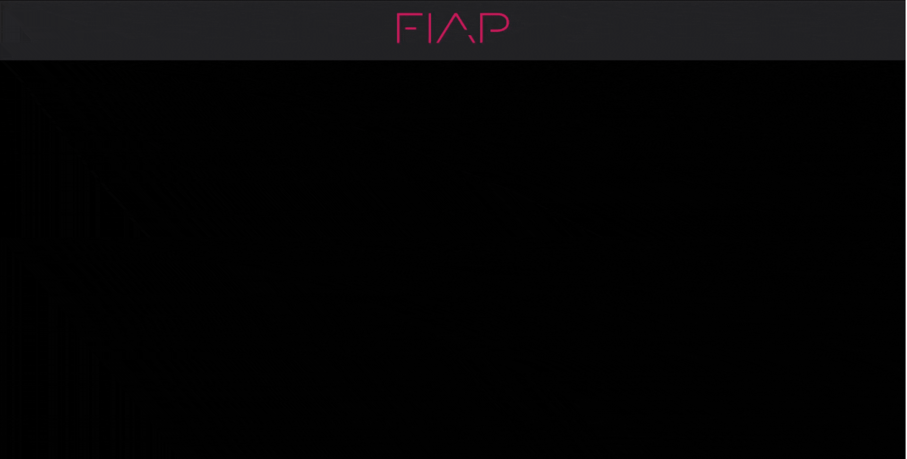
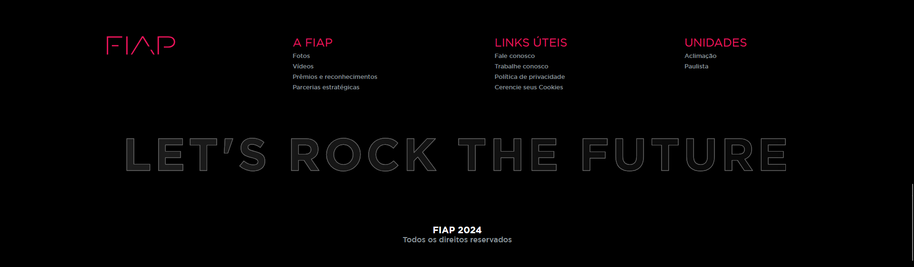

# Landing Page - Prova para Dev Front-End na FIAP

Este projeto é uma landing page desenvolvida como parte da prova para a posição de Desenvolvedor Front-End na FIAP. O objetivo é demonstrar habilidades em JavaScript, HTML e CSS.

## Índice

- [Visão Geral](#visão-geral)
- [Tecnologias Utilizadas](#tecnologias-utilizadas)
- [Estrutura do Projeto](#estrutura-do-projeto)
- [Instalação](#instalação)
- [Uso](#uso)
- [Funcionalidades](#funcionalidades)
- [Melhorias](#melhorias)
- [Autor](#autor)

## Visão Geral

A landing page foi projetada para ser responsiva e incluir algumas animações, como:

- **Header**
  - Uma animação no cabeçalho, onde uma borda cresce da esquerda para a direita conforme a página é rolada.
- **Intro**
  - Um `marquee` onde o texto vai da esquerda para a direita automaticamente, independente da página ser rolada.
  - Uma animação para a imagem (intro) que aparece de cima para baixo, de acordo com a posição x da página.
  - Um segundo `marquee` onde o texto vai da esquerda para a direita conforme a página é rolada.
- **Water**
  - Uma animação de imagens, onde conforme a página é rolada para baixo troca a imagem por outra, como se fossem os `frames` de um vídeo.
- **Cursos**
  - Uma animação na navegação entre os cursos, onde o tipo de curso, quando selecionado, fica com uma borda no topo mostrando que foi selecionado.
- **Faq**
  - Uma animação é exibida quando o mouse/dedo é passado em cima dos cards, revelando o conteúdo da pergunta.

## Tecnologias Utilizadas

- **ReactJS**: Biblioteca JavaScript para construir interfaces de usuário.
- **Vite**: Ferramenta de build rápida e leve para projetos modernos de front-end.
- **SCSS**: Uma linguagem de extensão do CSS que oferece recursos avançados como variáveis, aninhamento de seletores, mixins e muito mais, facilitando a escrita e manutenção de estilos complexos.
- **HTML**: Linguagem de marcação para estruturação da página.

## Estrutura do Projeto

```plaintext
Prova Fiap/
├── node_modules/
├── public/
│   └── favicon.ico
├── src/
│   ├── assets/
│   │   ├── fonts/
│   │   │   ├── gotham/
│   │   │   └── gotham.css
│   │   ├── imgs/
│   │   │   ├── water/
│   │   │   │   ├── index.jsx
│   │   │   │   ├── [...]
│   │   │   └── intro.png
│   │   ├── svgs/
│   │   │   └── logo-fiap.svg
│   ├── components/
│   │   ├── courses-section/
│   │   │   └── courses-section.jsx
│   │   ├── faq-section/
│   │   │   └── faq-section.jsx
│   │   ├── footer/
│   │   │   └── footer.jsx
│   │   ├── header/
│   │   │   └── header.jsx
│   │   ├── marquee/
│   │   │   └── marquee.jsx
│   │   ├── text-typer/
│   │   │   └── TextTyper.jsx
│   │   ├── water-scroll-images/
│   │   │   └── WaterScrollImages.jsx
│   │   └── Styles.scss
│   ├── pages/
│   │   └── home/
│   │       ├── Home.jsx
│   │       └── Home.scss
│   ├── routers/
│   │   └── app/
│   │       └── App.jsx
│   ├── index.scss
│   └── main.jsx
├── package.json
├── .eslintrc.cjs
├── vite.config.js
├── .gitignore
├── index.html
├── package-lock.json
└── README.md


## Instalação

Siga os passos abaixo para rodar o projeto localmente:

- **Clone o repositório:**:
```bash
git clone https://github.com/JoaoGabrielVianna/fiap-test.git
cd fiap-test
```

- **Instale as dependências:**
```bash
npm install
npm react-router-dom
```

- **Inicie o servidor de desenvolvimento:**
```bash
npm run dev
```

- **Abra o navegador e acesse:**
```bash
http://localhost:3000
```

## Uso

A landing page inclui um cabeçalho animado e é estilizada com uma fonte personalizada. A fonte utilizada é "Gotham HTF", que é importada e utilizada em diversos pesos.

## Funcionalidades

- **Fonte Personalizada**: Utilização da fonte "Gotham HTF" com diferentes pesos para estilização.
- **Responsividade**: Layout responsivo que se adapta a diferentes tamanhos de tela.

## Melhorias
- **First Section**
  - Adicionei uma animaça ao Titulo: A Melhor Faculdade de Tecnologia 
  
- **Footer**
  - Criei um footer 
  


## Autor

- **Nome:** João Gabriel Vianna Marinho
- **Email:** joaogabrielvianna05@gmail.com
- **LinkedIn:** [LinkedIn](www.linkedin.com/in/joão-gabriel-vianna-9439ba288/)
